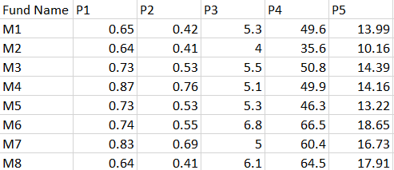
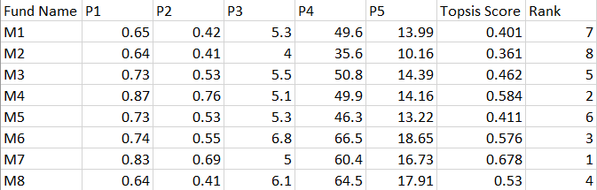

# Topsis Implementation

This project implements the **Technique for Order of Preference by Similarity to Ideal Solution (TOPSIS)** using Python. The program accepts a CSV input file containing criteria data, calculates the TOPSIS scores, ranks the options, and writes the results to an output CSV file using command line prompt.

---

## Input Data


---

## Impacts & Weights
Impacts specify whether a criterion is beneficial (+) or non-beneficial (-). 

Weights specify the relative importance of each criterion in the decision-making process.


- Weights used : "1,1,1,2,1"
- Impacts used : "+,+,-,+,-"

## Output Data


---

## Usage through command line prompt
Usages:
```bash
python <program.py> <InputDataFile> <Weights> <Impacts> <ResultFileName>
```
Example: 
```bash
python 102203103.py 102203103-data.csv “1,1,1,2,1” “+,+,-,+,-” 102203103-result.csv
```
--- 

## Requirements
The project uses the following Python libraries:
- **Pandas**
- **NumPy**
- **sys** 

To install the required libraries, run:
```bash
pip install pandas numpy
```

---


 
